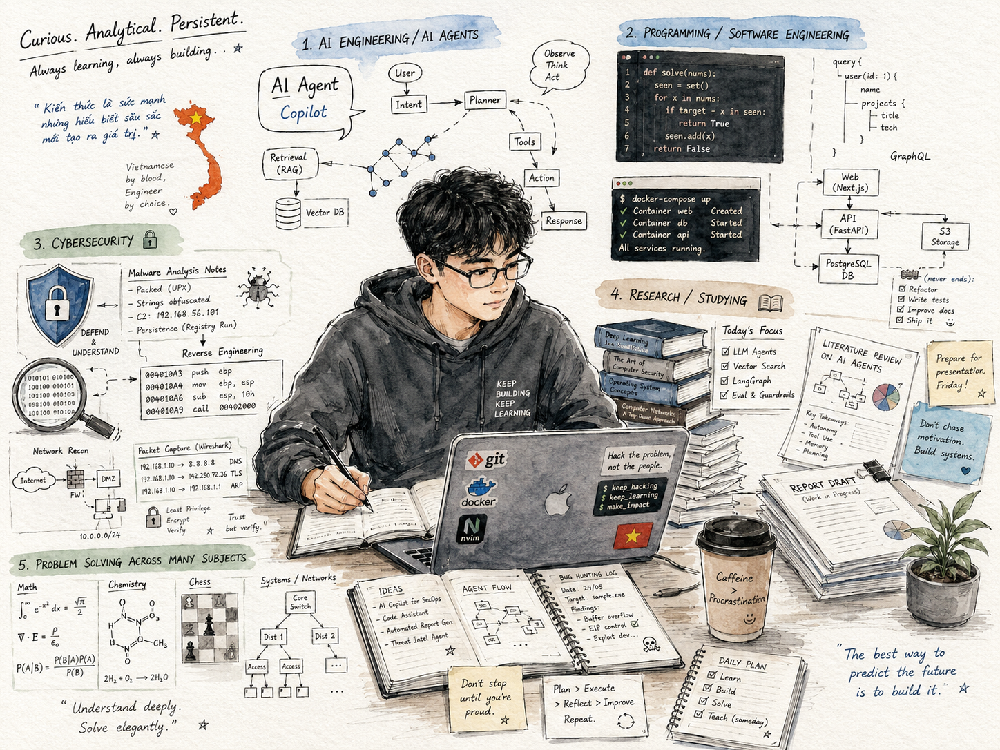

### Pentest | Web AppSec | IoT & Wireless

 

---

## 🧠 Pentest Focus

- **Web App Pentest:** Recon → Testing → Safe Exploitation → Reporting
- **IoT/Wireless Pentest:** Attack surface mapping → firmware/config review → BLE/Wi-Fi testing → hardening
- **Network Security:** Enterprise network design, segmentation, firewall policy, monitoring, and defensive architecture

> 🔒 **Ethics:** Everything here is for learning, authorized testing, and defensive improvement only.

---

## 🧰 Tools & Stack

---

## 🚀 Featured Work

<table>
  <tr>
    <td width="50%">
      <h3>
        <a href="https://github.com/ASEN-K5/esp32-wireless-security">
          ESP32 Wireless Security
        </a>
      </h3>
      

        An ESP32-based wireless security lab project for studying Wi-Fi management frames,
        wireless behavior, and defensive security awareness in an authorized lab environment.
      

      

        <b>Focus:</b> ESP32, Wi-Fi security, wireless lab, IoT security, authorized testing.
      

    </td>
    <td width="50%">
      <h3>
        <a href="https://github.com/ASEN-K5/MINA">
          MINA — Multi-Intelligence Network Agent
        </a>
      </h3>
      

        A multi-agent reconnaissance and reporting system designed for authorized security assessment,
        OSINT collection, attack surface analysis, and structured report generation.
      

      

        <b>Focus:</b> FastAPI, React, LangGraph, security automation, recon, reporting.
      

    </td>
  </tr>
</table>

---

## 📌 Current Learning Path

- Web Application Pentesting
- Wireless & IoT Security
- Network Security Design
- Malware Analysis Basics
- Reverse Engineering Basics
- AI Agents for Security Automation
- Security Report Writing

---

## 🧪 Security Lab Mindset

I focus on building practical security projects that combine:

- Clear methodology
- Controlled lab scope
- Reproducible testing
- Defensive explanation
- Professional documentation
- Ethical and authorized use

The goal is not only to find issues, but also to understand how systems work, how weaknesses appear, and how to improve them.

---

## 📫 Contact

- GitHub: [ASEN-K5](https://github.com/ASEN-K5)
- Email: txnhat2222@gmail.com

---

### Curious. Analytical. Persistent.

Always learning. Always building.

